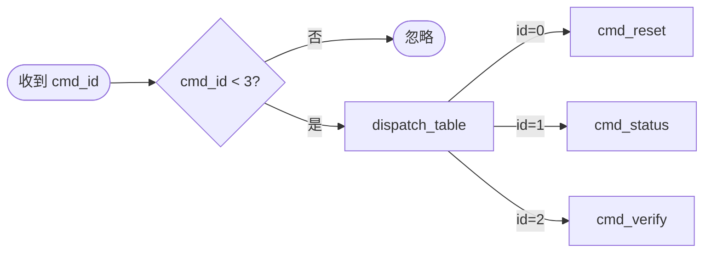

> [!abstract] TL;DR
> 函式指標讓 C 實現 callback、jump table、多型 driver 介面，是 RoT 中斷分派、bootloader 指令處理的核心機制。ARM 向量表本身就是函式指標陣列。語法類比 C# 的 `delegate`。

# C 語言 Module 4：函式指標

## 概念

函式在記憶體中也有位址，函式指標就是存這個位址的變數。  
C# 對應：`delegate`、`Action`、`Func`。

---

## 基本語法

```c
// 函式宣告
int add(int a, int b) { return a + b; }
int sub(int a, int b) { return a - b; }

// 函式指標型別：回傳 int，接受兩個 int 參數
int (*op)(int, int);

// 賦值
op = add;         // 不需要 &，函式名稱本身就是位址
op = &add;        // 這樣也合法

// 呼叫
int result = op(3, 4);   // 7
op = sub;
result = op(3, 4);       // -1
```

**函式指標概念示意：**

```
一般呼叫（固定）：
  add(3, 4) ──────────────────────────→ [ add 的機器碼 ] → 回傳 7

透過指標呼叫（可切換）：
  op = add;
  op(3, 4)  ──→ [ 位址 0x8100 ] ──→ [ add 的機器碼 ] → 回傳 7

  op = sub;   ← 切換指向的目標
  op(3, 4)  ──→ [ 位址 0x8200 ] ──→ [ sub 的機器碼 ] → 回傳 -1
```

語法記憶：`回傳型別 (*指標名)(參數型別列表)`

---

## typedef 簡化

```c
// 原本
int (*op)(int, int);

// 用 typedef 定義型別
typedef int (*BinaryOp)(int, int);

// 之後使用更清楚
BinaryOp op = add;
BinaryOp ops[4] = {add, sub};  // 函式指標陣列
```

---

## 嵌入式用途 1：Callback（回調）

事件發生時呼叫使用者指定的函式，不需要 if-else 硬編碼：

```c
typedef void (*IrqHandler)(void);

// 中斷控制器的結構
typedef struct {
    uint32_t    irq_num;
    IrqHandler  handler;   // 使用者設定的 callback
} IrqEntry;

void irq_register(IrqEntry *entry, uint32_t num, IrqHandler h) {
    entry->irq_num = num;
    entry->handler = h;
}

void irq_dispatch(IrqEntry *entry) {
    if (entry->handler != NULL) {
        entry->handler();  // 呼叫 callback
    }
}

// 使用者定義的 handler
void my_gpio_handler(void) {
    // 處理 GPIO 中斷
}

// 註冊
IrqEntry gpio_irq;
irq_register(&gpio_irq, 5, my_gpio_handler);
```

---

## 嵌入式用途 2：Jump Table（分派表）

根據 ID 呼叫對應函式，比 switch-case 更乾淨，也是 bootloader 常見設計：

```c
typedef void (*Command)(void);

void cmd_reset(void)  { /* 重置系統 */ }
void cmd_status(void) { /* 回報狀態 */ }
void cmd_verify(void) { /* 驗證 firmware */ }

// 分派表
Command dispatch_table[] = {
    cmd_reset,   // ID 0
    cmd_status,  // ID 1
    cmd_verify,  // ID 2
};

#define CMD_COUNT 3

void handle_command(uint8_t cmd_id) {
    if (cmd_id < CMD_COUNT) {
        dispatch_table[cmd_id]();  // 直接跳到對應函式
    }
}
```

**Jump Table 執行流程：**



RoT 的指令處理幾乎都是這個模式。

---

## 嵌入式用途 3：模擬介面（C 的 interface）

C 沒有 interface，用函式指標 struct 模擬：

```c
// 「介面」定義
typedef struct {
    int  (*read)(uint8_t *buf, uint32_t len);
    int  (*write)(const uint8_t *buf, uint32_t len);
    void (*reset)(void);
} FlashDriver;

// NOR Flash 的實作
int nor_read(uint8_t *buf, uint32_t len)       { /* ... */ return 0; }
int nor_write(const uint8_t *buf, uint32_t len) { /* ... */ return 0; }
void nor_reset(void)                            { /* ... */ }

FlashDriver nor_driver = {
    .read  = nor_read,
    .write = nor_write,
    .reset = nor_reset,
};

// RoT 驗證邏輯不需要知道是哪種 flash
int verify_firmware(FlashDriver *drv) {
    uint8_t buf[256];
    drv->read(buf, sizeof(buf));
    // 驗證 hash...
    return 0;
}

verify_firmware(&nor_driver);
```

**介面模式示意：**

```
verify_firmware() 只認識 FlashDriver 介面，不管底層是什麼硬體：

呼叫端（不知道是哪種硬體）
verify_firmware() ──→  FlashDriver NOR
                       ┌───────────────────┐
                       │ .read  ────────── ├──→ nor_read()
                       │ .write ────────── ├──→ nor_write()
                       └───────────────────┘

                       FlashDriver eMMC
                       ┌───────────────────┐
                       │ .read  ────────── ├──→ emmc_read()
                       │ .write ────────── ├──→ emmc_write()
                       └───────────────────┘

換硬體只需要換 driver，verify_firmware 的程式碼完全不用改。
```

這讓 RoT 的驗證邏輯可以換不同儲存媒介而不改程式碼。

---

## 向量表（Vector Table）

ARM Cortex-M 的中斷向量表就是函式指標陣列，放在固定記憶體位址：

```c
// 向量表：每個 entry 是一個函式指標
typedef void (*VectorEntry)(void);

// 放在記憶體最開頭（linker script 決定位址）
__attribute__((section(".vectors")))
VectorEntry vector_table[] = {
    (VectorEntry)0x20010000,  // 初始 Stack Pointer
    reset_handler,             // Reset
    nmi_handler,               // NMI
    hardfault_handler,         // HardFault
    // ...
};
```

M33 開機後第一件事就是從向量表取 Reset handler 位址並跳過去。

---

## 常見錯誤

```c
// 錯誤 1：呼叫 NULL 函式指標
typedef void (*Callback)(void);
Callback cb = NULL;
cb();  // crash

// 正確：使用前檢查
if (cb != NULL) cb();

// 錯誤 2：型別不匹配（compiler 不一定會報錯）
void handler_a(uint32_t arg) { }
typedef void (*Handler)(void);  // 沒有參數的型別
Handler h = handler_a;          // 型別不符，undefined behavior
```

---

## 下一步

> [!tip] 複習問題
> 1. 函式指標的宣告語法是什麼？`typedef` 如何簡化？寫出一個接受兩個 `int`、回傳 `int` 的函式指標型別。
> 2. Jump table 比 switch-case 的優點是什麼？在 RoT 的哪個場景會用到？
> 3. 用函式指標 struct 模擬 interface 讓 `verify_firmware()` 得到什麼好處？換硬體時需要改哪些程式碼？

→ [[05-embedded-patterns|Module 5：嵌入式關鍵語法]]
