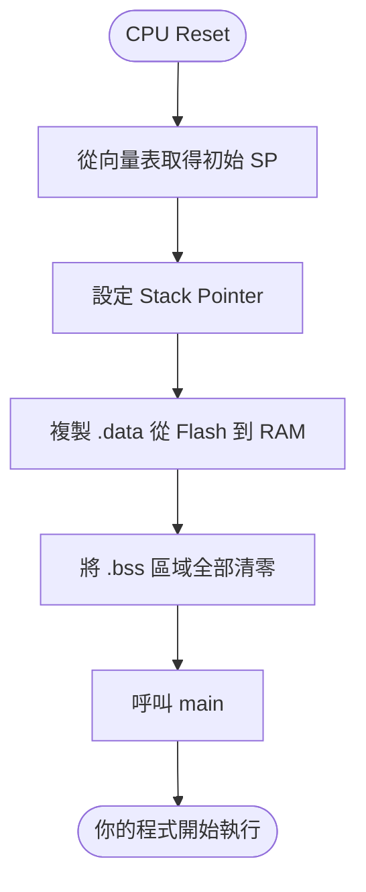

> [!abstract] TL;DR
> 嵌入式程式的記憶體分 Text/Data/BSS/Stack/Heap 五段，理解各段的位置與生命週期是除錯 stack overflow、資料損毀、boot 失敗的基礎。Startup code 在 `main()` 前完成 `.data` 搬移與 `.bss` 清零。

# C 語言 Module 6：記憶體模型

嵌入式開發者必須清楚每個變數「住在哪裡」。  
記憶體用錯會造成 stack overflow、資料損毀、boot 失敗。

---

## 記憶體分段（Memory Sections）

一個 C 程式的記憶體分成幾個區域（由 linker script 決定位址）：

```
高位址
       ┌─────────────────┐
       │      Stack      │  ← 往下長，函式呼叫、區域變數
       │        ↓        │
       │                 │
       │        ↑        │
       │      Heap       │  ← 往上長，malloc（嵌入式盡量不用）
       ├─────────────────┤
       │      BSS        │  ← 未初始化的全域/static 變數（全為 0）
       ├─────────────────┤
       │      Data       │  ← 已初始化的全域/static 變數
       ├─────────────────┤
       │      Text       │  ← 程式碼（唯讀，存在 Flash）
       └─────────────────┘
低位址
```

---

## 各段說明

用一個完整程式對應每個段：

```c
// ── Text 段（程式碼）──────────────────────────────
// 你寫的所有函式，編譯後的機器碼都在這裡
// 存在 Flash，唯讀，CPU 從這裡讀指令來執行
void verify(void) { ... }
void main(void)   { ... }

// ── Data 段（已初始化的全域變數）─────────────────
// 有給初始值的全域變數
// 初始值燒在 Flash，開機時複製到 RAM
uint32_t device_id = 0xABCD1234;   // Data
const char *name   = "RoT v1.0";   // Data

// ── BSS 段（沒有初始值的全域變數）───────────────
// 沒有給初始值，開機時 startup code 全部清為 0
// 不佔 Flash 空間（反正都是 0，不需要存）
uint8_t  rx_buffer[1024];          // BSS
uint32_t error_count;              // BSS

void foo(void) {
    // ── Stack（函式的區域變數）────────────────────
    // 呼叫函式時自動產生，函式結束自動消失
    uint8_t  local_hash[32];       // Stack
    uint32_t temp = 0;             // Stack

    // ── Heap（malloc 動態分配）────────────────────
    // 你手動要、手動還，嵌入式盡量不用
    uint8_t *buf = malloc(64);     // Heap
    free(buf);
}
```

**一句話記憶：**

| 段 | 在哪 | 什麼時候有 | 你負責嗎 |
|---|---|---|---|
| Text | Flash | 永遠 | 不用管 |
| Data | Flash → RAM | 開機後 | 不用管（startup 搬） |
| BSS | RAM | 開機後 | 不用管（startup 清零） |
| Stack | RAM | 呼叫函式時 | 不用管（CPU 自動） |
| Heap | RAM | 你 malloc 時 | **你要管**（記得 free） |

---

### Text（程式碼）

```c
void foo(void) { return; }  // 這個函式的機器碼在 Text 段
```

存在 Flash（NOR Flash），通常是唯讀的。

---

### Data（已初始化全域變數）

```c
uint32_t device_id = 0xABCD1234;  // 存在 Data 段
```

初始值存在 Flash，開機時由 startup code 複製到 RAM。

---

### BSS（未初始化全域變數）

```c
uint8_t rx_buffer[1024];  // 存在 BSS 段
static uint32_t counter;  // 也在 BSS
```

不佔 Flash 空間，開機時 startup code 把 BSS 全清為 0。  
**重要**：這就是為什麼全域變數在 C 裡預設是 0。

---

### Stack（堆疊）

```c
void process(void) {
    uint8_t local_buf[64];  // 在 Stack 上
    uint32_t temp = 0;      // 在 Stack 上
    // 函式返回後自動釋放
}
```

- 由 CPU 自動管理，進函式時往下長，返回時縮回
- 大小有限（嵌入式常常只有幾 KB）
- **Stack overflow**：用太多導致覆蓋其他資料，非常難 debug

**Stack 呼叫示意：**

```
① 呼叫前                ② 呼叫 process() 後      ③ process() 返回後

高位址                  高位址                    高位址
┌────────────────┐      ┌────────────────┐        ┌────────────────┐
│  main          │      │  main          │        │  main          │
├────────────────┤      ├────────────────┤        ├────────────────┤
│                │←SP   │  return addr   │        │                │←SP
│                │      │  local_buf[64] │←SP     │                │
│                │      │  temp          │        │                │
│                │      │                │        │                │
低位址                  低位址                    低位址

SP 指向 stack 頂部（目前可用位置）
呼叫 process() → SP 往下移，騰出空間給 local_buf 和 temp
返回後 → SP 往回移，空間自動釋放（值還在，但下次呼叫會覆蓋）
```

---

### Heap（堆積）

```c
uint8_t *buf = malloc(256);  // 在 Heap 上
free(buf);                   // 手動釋放
```

嵌入式**盡量避免 malloc**，原因：
- 記憶體碎片化（長時間運行後可能 malloc 失敗）
- 不可預測的分配時機
- 安全關鍵程式碼要求確定性行為

---

## 嵌入式的記憶體分配策略

### 1. Static allocation（最常用）

```c
// 全域或 static，編譯時期就決定大小和位址
static uint8_t sha_buffer[256];
static uint8_t key_storage[32];
```

優點：零碎片化，大小和位址在編譯時期確定。

---

### 2. Stack allocation（小型區域資料）

```c
void verify_block(void) {
    uint8_t hash[32];        // 小 buffer 放 stack
    uint32_t result = 0;
    // 函式結束自動釋放
}
```

**規則**：不要在 stack 上放大陣列，嵌入式 stack 通常 2–8KB。

---

### 3. Memory Pool（進階，替代 malloc）

```c
// 預先分配固定數量的 block，從 pool 取用
#define POOL_SIZE 8
#define BLOCK_SIZE 64

static uint8_t pool_storage[POOL_SIZE][BLOCK_SIZE];
static uint8_t pool_used[POOL_SIZE];

uint8_t *pool_alloc(void) {
    for (int i = 0; i < POOL_SIZE; i++) {
        if (!pool_used[i]) {
            pool_used[i] = 1;
            return pool_storage[i];
        }
    }
    return NULL;  // pool 滿了
}

void pool_free(uint8_t *ptr) {
    for (int i = 0; i < POOL_SIZE; i++) {
        if (pool_storage[i] == ptr) {
            pool_used[i] = 0;
            return;
        }
    }
}
```

---

## Linker Script 概念

**Linker（連結器）是什麼：** C 程式的編譯分兩步：
1. **編譯器（Compiler）**：把 `.c` 檔編譯成 `.o`（目的檔），但裡面的函式位址還是相對的（「這個函式在哪裡」還不知道）
2. **連結器（Linker）**：把所有 `.o` 合併成最終的執行檔，決定每個函式和變數的真實位址

```
main.o   ─┐
flash.o  ─┼── Linker ──→ firmware.elf（有真實位址）──→ firmware.bin
uart.o   ─┘         ↑
                linker script 告訴 linker 各段放哪裡
```

**Linker script（`.ld` 檔）** 告訴 linker：「Text 段放在 Flash 的 `0x08000000`，Data 段放在 RAM 的 `0x20000000`」。

Linker script（`.ld` 檔）決定各段放在哪個實體位址：

```
/* 簡化範例 */
MEMORY {
    FLASH (rx)  : ORIGIN = 0x08000000, LENGTH = 2M   /* NOR Flash */
    RAM   (rwx) : ORIGIN = 0x20000000, LENGTH = 256K  /* SRAM */
}

SECTIONS {
    .text : { *(.text*) } > FLASH    /* 程式碼放 Flash */
    .data : { *(.data*) } > RAM AT > FLASH  /* 資料的 LMA 在 Flash，VMA 在 RAM */
    .bss  : { *(.bss*)  } > RAM      /* BSS 放 RAM */
}
```

**VMA vs LMA 是什麼：**

```
LMA（Load Memory Address）= 資料「存放」的位址
  → 你把 firmware 燒進 Flash，.data 的初始值就存在 Flash 的某個位址

VMA（Virtual Memory Address）= 程式「執行時」用的位址
  → 你的程式碼說 &device_id 是 0x20000010，這是 RAM 的位址

問題：初始值在 Flash，但程式碼要去 RAM 讀
解法：startup code 開機時把 .data 從 LMA（Flash）複製到 VMA（RAM）
```

- **VMA**（Virtual Memory Address）：程式執行時用的位址（RAM）
- **LMA**（Load Memory Address）：資料存放的位址（Flash，跟著 firmware 燒進去）
- 開機時 startup code 把 .data 從 LMA 複製到 VMA

這就是為什麼全域變數的初始值能從 Flash 搬到 RAM。

---

## Startup Code

開機後、`main()` 之前，CPU 執行 startup code（通常是 `startup.s` 或 `crt0.c`）：

```
1. 設定 Stack Pointer（指向 RAM 頂部）
2. 把 .data 從 Flash 複製到 RAM
3. 把 .bss 清零
4. 呼叫 main()
```

**Startup Code 流程：**



**VMA vs LMA 示意：**

```
Flash（LMA：儲存位址）         RAM（VMA：執行位址）
0x08000000                     0x20000000
┌─────────────────┐            ┌─────────────────┐
│   .text         │            │   .bss          │ ← startup 清零（未初始化）
│   (code)        │            │   (uninit)      │
│   .rodata       │            ├─────────────────┤
│   (read-only)   │            │   .data         │ ← startup 從 Flash 複製來
│   .data init    │──startup──→│   (initialized) │
│   (backup)      │  (copy)    │                 │
└─────────────────┘            └─────────────────┘
                                        ↑
                                    Stack（往下長）
```

在 RoT 專案裡，你需要理解這個流程，因為 M33 的 startup 是你控制的。

---

## 常見問題

```c
// 問題 1：Stack overflow
void bad_function(void) {
    uint8_t huge_buffer[8192];  // 8KB 在 stack 上，可能超過 stack 大小
    // 解法：改成 static 或全域
    static uint8_t huge_buffer[8192];
}

// 問題 2：以為 local 變數初始化為 0
void function(void) {
    int x;           // stack 上的值是垃圾，不是 0
    printf("%d", x); // undefined behavior
    // 解法：明確初始化
    int x = 0;
}

// 問題 3：全域 vs static 全域 的差異
int global_a = 1;         // 所有 .c 檔都看得到
static int global_b = 1;  // 只有這個 .c 檔看得到（推薦）
```

---

## 下一步

> [!tip] 複習問題
> 1. BSS 段和 Data 段的差異是什麼？兩者各存在 Flash 還是 RAM？
> 2. 為什麼嵌入式開發避免 `malloc`？替代方案 static allocation 和 memory pool 各適合什麼場景？
> 3. VMA 和 LMA 的差異是什麼？startup code 在 `main()` 前做了哪四件事？

> [!example] 參考答案
>
> **1. BSS vs Data**
>
> BSS 是**未初始化**的全域/static 變數，啟動時清零，只存在 RAM，不佔 Flash 空間。
>
> Data 是**有初始值**的全域/static 變數，初始值存在 Flash（LMA），啟動時 startup code 複製到 RAM（VMA），執行時住在 RAM。
>
> **2. 避免 malloc 的原因與替代方案**
>
> 嵌入式避免 malloc 是因為：碎片化、分配時間不確定（即時系統無法接受）、heap 空間小。
>
> - **Static allocation**：編譯時決定好大小，程式啟動就存在，適合大小固定、生命週期跟程式一樣長的資源。
> - **Memory pool**：預先分配一塊連續空間，用 offset 或槽位管理，無碎片問題，適合需要動態借還但又不想用 malloc 的情境。
>
> **3. VMA vs LMA，及 startup code 四件事**
>
> VMA（Virtual Memory Address）是程式執行時的地址，位於 RAM；LMA（Load Memory Address）是資料實際儲存的地址，位於 Flash。大部分情況 LMA = VMA，例外是 `.data` 段。`.text` 通常直接在 Flash 執行，LMA = VMA。
>
> Startup code 在 `main()` 前做四件事：
> 1. 初始化 Stack Pointer（SP）— 最先做，後續步驟需要 stack
> 2. 把 `.data` 從 Flash（LMA）複製到 RAM（VMA）
> 3. 把 `.bss` 清零
> 4. 呼叫 `main()`

→ [[07-multi-file|Module 7：多檔案組織]]
