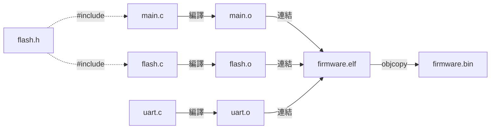

> [!abstract] TL;DR
> 嵌入式專案用 `.h`/`.c` 拆分模組，`#ifndef` guard、opaque pointer、前綴命名是標準組織方式。Makefile 管理多檔編譯，linker script 決定最終記憶體佈局。

# C 語言 Module 7：多檔案組織

## 為什麼要拆檔案

嵌入式專案通常有幾十到幾百個 .c 檔。  
每個檔案負責一個模組（flash driver、crypto、uart 等），  
透過 .h 檔對外公開介面，隱藏實作細節。

**編譯流程示意：**



---

## .h 和 .c 的職責

```
uart.h  → 對外說「我能做什麼」（宣告）
uart.c  → 說明「我怎麼做」（定義/實作）
```

**h / c 分工示意：**

```
flash.h（公開介面）:           flash.c（私有實作）:
┌───────────────────────┐     ┌───────────────────────┐
│ typedef FlashResult   │     │ #define FLASH_BASE    │  ← 外部看不到
│ flash_init()  (decl)  │←───→│ static current_addr   │  ← 外部看不到
│ flash_read()  (decl)  │ API │ flash_init() { ... }  │
│ flash_write() (decl)  │     │ flash_read() { ... }  │
└───────────────────────┘     └───────────────────────┘
         ↑
         │ #include "flash.h"
┌───────────────────────┐
│ main.c                │  只需要知道「能做什麼」
│ flash_init();         │  不需要知道「怎麼做到的」
│ flash_read(...);      │
└───────────────────────┘
```

其他模組只需要 `#include "uart.h"`，不用知道 uart.c 的細節。

---

## 完整範例：flash 模組

### flash.h

```c
#ifndef FLASH_H
#define FLASH_H

#include <stdint.h>

/* 對外公開的型別 */
typedef enum {
    FLASH_OK    = 0,
    FLASH_ERROR = 1,
} FlashResult;

/* 對外公開的函式 */
FlashResult flash_init(void);
FlashResult flash_read(uint32_t addr, uint8_t *buf, uint32_t len);
FlashResult flash_write(uint32_t addr, const uint8_t *buf, uint32_t len);

#endif /* FLASH_H */
```

### flash.c

```c
#include "flash.h"

/* 這些只有 flash.c 看得到 */
#define FLASH_BASE  0x08000000U
#define PAGE_SIZE   0x1000U

static uint32_t current_addr = FLASH_BASE;  // 內部狀態，外部不知道

static int is_valid_addr(uint32_t addr) {   // 內部工具函式
    return (addr >= FLASH_BASE);
}

/* 對外公開的函式實作 */
FlashResult flash_init(void) {
    current_addr = FLASH_BASE;
    return FLASH_OK;
}

FlashResult flash_read(uint32_t addr, uint8_t *buf, uint32_t len) {
    if (!is_valid_addr(addr)) return FLASH_ERROR;
    /* 實際讀取邏輯 */
    return FLASH_OK;
}

FlashResult flash_write(uint32_t addr, const uint8_t *buf, uint32_t len) {
    if (!is_valid_addr(addr)) return FLASH_ERROR;
    /* 實際寫入邏輯 */
    return FLASH_OK;
}
```

### main.c（使用者）

```c
#include "flash.h"
// 不需要知道 flash.c 的任何細節

int main(void) {
    flash_init();

    uint8_t buf[32];
    flash_read(0x08000000, buf, sizeof(buf));
    return 0;
}
```

---

## `extern`：跨檔案共用變數

```c
// config.c
uint32_t system_clock = 64000000U;  // 定義

// main.c
extern uint32_t system_clock;  // 宣告：「這個變數在別的 .c 裡定義」
// 現在可以使用 system_clock
```

**規則**：盡量不用 `extern` 共用變數，改用函式存取（封裝原則）。

```c
// 更好的做法
// config.c
static uint32_t system_clock = 64000000U;

uint32_t config_get_clock(void) {
    return system_clock;
}

// main.c
#include "config.h"
uint32_t clk = config_get_clock();
```

---

## Opaque Pointer（不透明指標）

**為什麼需要隱藏 struct 內部：** 如果 `.h` 裡暴露了 struct 的完整欄位，外部程式碼可以直接存取（甚至意外修改）你的內部狀態。Opaque Pointer 讓外部只知道「這個型別存在」，但不知道裡面有什麼，強制用你提供的函式存取。

```
沒有 Opaque Pointer：
  // sha256.h 裡定義完整的 struct
  外部可以直接寫 ctx.state[0] = 0; → 破壞你的內部狀態！

有 Opaque Pointer：
  // sha256.h 裡只宣告型別，不定義內容
  外部只能呼叫 sha256_update()，根本存取不到 state
```

隱藏 struct 的內部結構，只讓外部知道「有這個型別存在」：

```c
/* sha256.h */
#ifndef SHA256_H
#define SHA256_H

/* 外部只知道 Sha256Ctx 是某個 struct，不知道裡面有什麼 */
typedef struct Sha256Ctx Sha256Ctx;

Sha256Ctx *sha256_new(void);
void sha256_update(Sha256Ctx *ctx, const uint8_t *data, uint32_t len);
void sha256_final(Sha256Ctx *ctx, uint8_t digest[32]);
void sha256_free(Sha256Ctx *ctx);

#endif
```

```c
/* sha256.c */
#include "sha256.h"

/* 完整定義只在 .c 裡，外部看不到 */
struct Sha256Ctx {
    uint32_t state[8];
    uint8_t  buffer[64];
    uint64_t count;
};
```

外部程式碼無法直接存取 `state` 或 `buffer`，強制透過函式介面。  
等同 C# 的 `private` 欄位 + `public` 方法。

---

## Makefile 基礎

**Makefile 是什麼：** 定義「哪個檔案依賴哪些檔案、要怎麼產生」的腳本。`make` 指令讀取它，只重新編譯有改動的部分。

**Makefile 的語法：**

```
目標: 依賴1 依賴2
	命令（必須用 Tab 縮排，不能用空格）
```

多個 .c 檔需要 Makefile 管理編譯：

```makefile
CC     = arm-none-eabi-gcc   # 交叉編譯器（cross-compiler，在 x86 電腦上編譯 ARM 程式）
CFLAGS = -Wall -O2 -mcpu=cortex-m33

# 目標：最終的 binary
firmware.elf: main.o flash.o uart.o crypto.o
	$(CC) $(CFLAGS) -T linker.ld -o $@ $^
#                                   ↑   ↑
#                    $@ = 目標名稱（firmware.elf）
#                         $^ = 所有依賴（main.o flash.o uart.o crypto.o）

# 每個 .c 編譯成 .o（%是萬用字元，匹配任何名稱）
%.o: %.c
	$(CC) $(CFLAGS) -c -o $@ $<
#                         ↑   ↑
#              $@ = 目標（例如 main.o）
#                   $< = 第一個依賴（例如 main.c）

clean:
	rm -f *.o *.elf
```

**自動變數總結：**

| 變數 | 意思 | 範例 |
|------|------|------|
| `$@` | 目標（冒號左邊） | `firmware.elf` |
| `$^` | 所有依賴（冒號右邊全部）| `main.o flash.o uart.o` |
| `$<` | 第一個依賴 | `main.c` |

---

## 命名慣例（業界標準）

嵌入式 C 沒有 namespace，用前綴區分模組：

```c
/* flash 模組 */
flash_init()
flash_read()
FLASH_OK        // 常數（全大寫）
FlashResult     // 型別（PascalCase）

/* crypto 模組 */
crypto_sha256()
crypto_sign()
CRYPTO_KEY_LEN

/* 不好的命名 */
init()          // 哪個模組的 init？
read()          // 和系統呼叫衝突
```

---

## 典型的 RoT 專案結構

```
rot-firmware/
├── Makefile
├── linker.ld
├── src/
│   ├── main.c
│   ├── startup.s         ← 向量表、初始化
│   ├── flash/
│   │   ├── flash.h
│   │   └── flash.c
│   ├── crypto/
│   │   ├── sha256.h
│   │   ├── sha256.c
│   │   ├── ecdsa.h
│   │   └── ecdsa.c
│   ├── boot/
│   │   ├── secure_boot.h
│   │   └── secure_boot.c  ← M33 驗證 A35 的邏輯
│   └── hal/
│       ├── gpio.h
│       ├── gpio.c
│       ├── uart.h
│       └── uart.c
└── include/
    └── common.h           ← 共用型別、macro
```

---

## 下一步

> [!tip] 複習問題
> 1. Include guard（`#ifndef`）的作用是什麼？沒有它會發生什麼？
> 2. Opaque pointer 解決了什麼問題？在 `.h` 和 `.c` 分別如何寫？
> 3. 為什麼嵌入式 C 函式名稱要加模組前綴（如 `flash_read`）？不加前綴有什麼風險？

> [!example] 參考答案
>
> **1. Include guard**
>
> 防止同一個 `.h` 被重複 include 時產生重複定義錯誤。`.h` 可能被多個 `.c` include，也可能被同一個 `.c` 間接 include 兩次。沒有 guard，`typedef`/`struct` 宣告出現兩次，編譯失敗。
>
> ```c
> #ifndef FLASH_H   // 第一次進來：還沒定義，繼續
> #define FLASH_H   // 定義這個 symbol
> // ... 內容 ...
> #endif            // 第二次進來：已定義，整個跳過
> ```
>
> **2. Opaque pointer**
>
> 讓外部無法直接得知 struct 的實際內容，只知道型別存在，無法從外部直接修改內部欄位。等同 C# 的 `private` 欄位 + `public` 方法。
>
> ```c
> // flash.h（只宣告型別存在，不定義內容）
> typedef struct FlashCtx FlashCtx;
>
> // flash.c（真正的定義在這裡）
> struct FlashCtx {
>     uint32_t addr;
>     uint8_t  buf[256];
> };
> ```
>
> **3. 模組前綴**
>
> C 沒有 namespace，前綴是唯一的模組隔離手段。不加前綴的風險：跨模組撞名導致 linker error，或誤連結到同名但行為不同的函式，且不會有任何警告。

→ [[08-pitfalls|Module 8：常見陷阱與 Undefined Behavior]]
